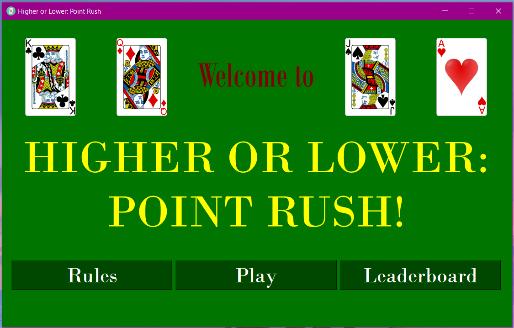
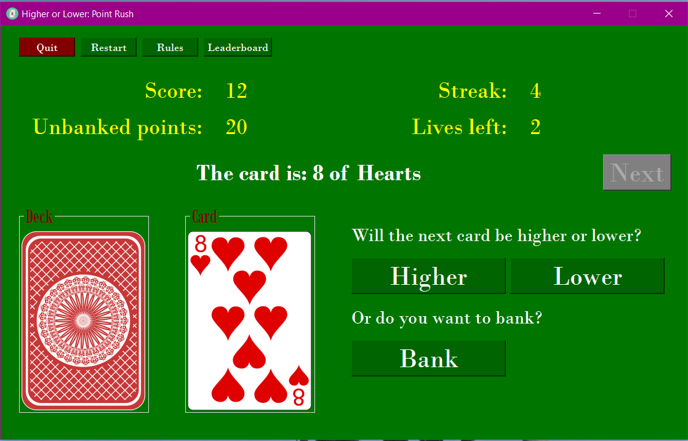

# Higher or Lower: Point Rush

Welcome to **Higher or Lower: Point Rush**, a card game built in Python where players guess if the next card will be higher or lower. Build streaks, bank points strategically, and aim for the leaderboard!




## Features
- **Gameplay**:
  - Guess if the next card is higher or lower.
  - Bank points strategically to secure your score.
  - Earn streak bonuses for consecutive correct guesses.
- **Joker Mechanics**:
  - Draw a Joker to gain an extra life.
- **Leaderboard**:
  - Save your scores and compete for the top positions.
  - Stored in a SQLite database
- **Graphical Interface**:
  - Built with PyQt5 for an interactive user experience.

## Installation

### Prerequisites
- Python 3.9 (issues with PyQt5 with versions >9)
- [Conda](https://docs.conda.io/en/latest/) (recommended) or `pip` for dependency management

### Setting Up the Environment

#### Using Conda (recommended)
1. Clone the repository:
   ```bash
   git clone https://github.com/yourusername/higher-or-lower.git
   cd higher-or-lower
   ```
2. Create the environment:
   ```bash
   conda env create -f environment.yml
   ```
3. Activate the environment:
   ```bash
   conda activate higher_or_lower
   ```

#### Using Pip
1. Clone the repository:
   ```bash
   git clone https://github.com/yourusername/higher-or-lower.git
   cd higher-or-lower
   ```
2. Install dependencies:
   ```bash
   pip install -r requirements.txt
   ```

## How to Play
1. Run the program:

   GUI (recommended):
   ```bash
   python -m gui.main
   ```
   Command line interface
   ```bash
   python -m cli.higherOrLower
   ```
2. Choose between:
   - **Play Game**: Start a new game.
   - **View Rules**: Learn how to play.
   - **Leaderboard**: Check the top scores.
3. During the game:
   - Guess **Higher** or **Lower**.
   - **Bank** your points to save them safely.
   - Watch out for streak bonuses and Jokers.

## Game Rules
- Start with 3 lives.
- Earn points for correct guesses:
  - Base Score: `2`
  - Streak Bonus: `2 * Current Streak`
- Incorrect guesses lose 1 life and your unbanked points.
- Drawing a Joker gives an extra life.
- The game ends when you lose all your lives.

## Files and Directories
Below is an overview of the project structure:

- **`cards/`**: Contains the logic for handling card-related operations.
  - `card.py`: Defines the `Card` class and its behaviour.
  - `deck.py`: Implements the `Deck` class, including shuffling and card drawing.

- **`cli/`**: Contains a command-line interface version of the game.
  - `higherOrLower.py`: CLI implementation of the Higher or Lower game.

- **`games/`**: Includes the core game logic.
  - `higherOrLower.py`: Implements the main game logic, such as scoring, streaks, and Joker rules.

- **`gui/`**: Contains the graphical user interface components.
  - `card-images/`: Stores images of cards used in the game.
    - Card images - https://byronknoll.blogspot.com/2011/03/vector-playing-cards.html
    - Back of card image - https://pixabay.com/vectors/card-card-game-playing-card-game-7031432/
    - Joker Icon - [Diamond card icons created by Elite Art - Flaticon](https://www.flaticon.com/free-icons/diamond-card) title="diamond card icons"
  - `ui/`: Holds `.ui` files for the PyQt5 GUI design.
  - `homeUI.py`: Defines the home screen functionality.
  - `leaderboardDialog.py`: Displays the leaderboard dialog.
  - `main.py`: The main entry point for running the game.
  - `playUI.py`: Defines the gameplay screen functionality.

- **`leaderboard/`**: Handles the leaderboard functionality and database operations.
  - `leaderboard.py`: Manages leaderboard storage, retrieval, and updates using SQLite.

- **`imgs/`**: Screenshots of gameplay for readme

- **`.gitignore`**: Specifies files and directories to ignore in version control.

- **`environment.yml`**: Conda environment file listing dependencies and setup instructions.

- **`requirements.txt`**: Pip requirements file listing dependencies and setup instructions.

- **`leaderboard.db`**: The main SQLite database used to store leaderboard scores.

- **`README.md`**: This documentation file.

- **`LICENSE.txt`**: MIT License

## Leaderboard
- Scores are stored in `leaderboard.db` (SQLite).
- Top scores can be viewed through the game UI or the terminal.

## Known Issues
- Ensure write permissions for the directory containing `leaderboard.db`.
- The game may behave unexpectedly if database files are manually modified.

## Future Improvements
- Add sound effects and animations to enhance gameplay.
- Introduce multiplayer functionality.
- Expand with additional game modes.
- Cleaner GUI for gameplay with individual UIs for rules and leaderboard.

## Contributing
Feel free to fork the repository and submit pull requests for improvements or bug fixes.

## License
This project is licensed under the MIT License. See `LICENSE` for details.
